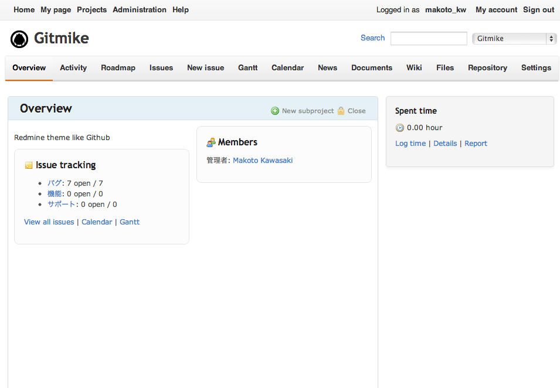

Redmine gitmike theme
==============

This is github-like theme for Redmine.
It is based on A1 theme version 1.0.3 by Kirill Bezrukov www.redminecrm.com.



## Installation

### Install theme

1. Download from https://github.com/makotokw/redmine-theme-gitmike/tags
1. Move to `redmine/public/theme/gitmike`

Or by using git:

```
cd redmine/public/theme
git clone https://github.com/makotokw/redmine-theme-gitmike.git gitmike
```

### Change theme

1. Open your redmine on a browser
1. Login as admin user
1. Go to ``Administration > Settings > Display``
1. Select ``Gitmike`` on ``Theme``

## Development

```
cd redmine/public/theme
git clone https://github.com/makotokw/redmine-theme-gitmike.git gitmike
cd gitmike
npm install -g gulp-cli
yarn
gulp debug
```

## License

GNU General Public License (GPL) Version 2

