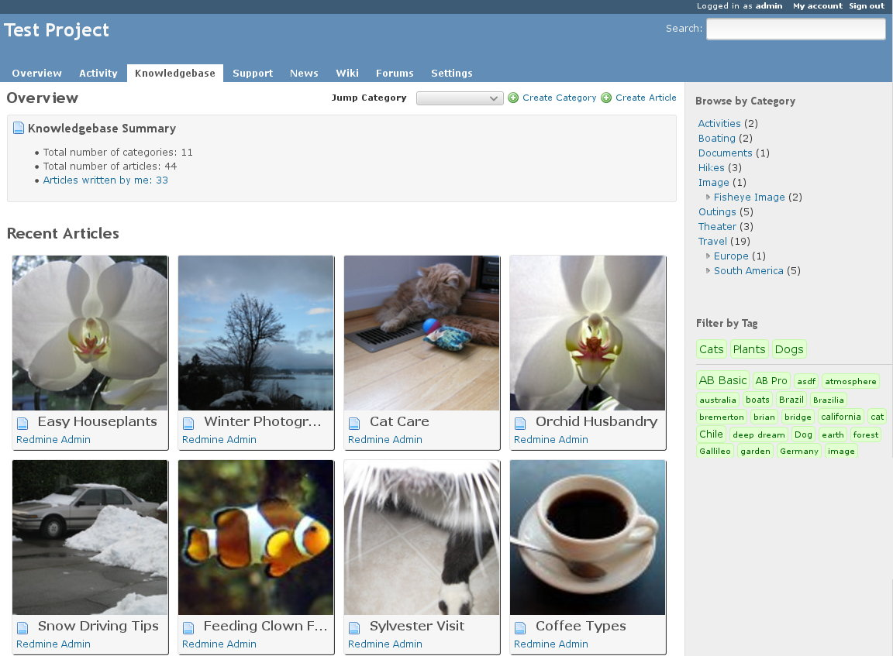

# MAINTAINER NEEDED

The Redmine Knowledgebase is still receiving pull requests and issues, but does not have an active maintainer. I (@alexbevi) stepped away a number of years ago, and Robert (@robspearman) stepped in and took over. It's been a couple years now and Robert's availability is diminished so we're on the lookout for a new steward for the project. If you're interested shoot me an email at alex@alexbevi.com.

# Redmine Knowledgebase Plugin



## Overview

This plugin adds professional knowledgebase functionality to the [Redmine](http://www.redmine.org/) project management application.

## Recent Changes

* Redmine 4.1.x support (thanks @Reshetov!)
* No longer conflicts with Redmine CRM plugin.
* Tiled visual indexes are now supported using thumbnails.
* Articles are better formatted to work with more themes.
* Tag logic is improved and critical tags can be defined easily.
* Email notifications are better formatted.
* Bug fixes.

## Warnings

The latest version of this plugin is for Redmine 4.1.x. If you're still using an older Redmine, checkout tag v3.2.2 for Redmine 3.x or even the ancient `redmine-2.x` branch.

As of 4.1.x, this plugin can now coexist with the Redmine CRM plugin.

## Introduction

[](https://gitter.im/alexbevi/redmine_knowledgebase?utm_source=badge&utm_medium=badge&utm_campaign=pr-badge&utm_content=badge)

<a href="http://www.packtpub.com/redmine-plugin-extension-and-development/book" target ="_blank">

</a>

[Redmine](http://www.redmine.org) is just plain awesome, and has proven to provide 90% of the functionality I need. The one feature that was missing was a usable knowledgebase component. I've looked at some of the open source solutions available, but couldn't find anything that fit my needs exactly. Seeing as Redmine is so easily extended, I figured why not create it for this platform instead of starting yet another project from scratch :P

**SHAMELESS PLUG** This plugin is discussed in [Redmine Plugin Extension and Development](https://www.packtpub.com/product/redmine-plugin-extension-and-development/9781783288748), which is now available from Packt Publishing. 

## Features

* Article versioning
* View differences between versions
* Email notifications and atom feeds
* Categorization of articles
* Article ratings
* File attachments
* Comment on articles
* Article tagging
* Visual indexes with thumbnails (optional)
* Project-based permissions

## Installation

To install the knowledgebase, execute the following commands from the root of your redmine directory, assuming that your RAILS_ENV enviroment variable is set to "production":

    git clone git://github.com/alexbevi/redmine_knowledgebase.git plugins/redmine_knowledgebase
    bundle install
    rake redmine:plugins:migrate NAME=redmine_knowledgebase

More information on installing Redmine plugins can be found here: [http://www.redmine.org/wiki/redmine/Plugins](http://www.redmine.org/wiki/redmine/Plugins "Redmine Plugins")

After the plugin is installed and the db migration completed, you will
need to restart Redmine for the plugin to be available.

### Updating from v2.3.0 (Should work for all 2.x versions but has not been tested)

To update redmine from v2.3.0 to 3.0+ you will first want to delete ``redmine_knowledgebase`` from the the ``/plugins`` and ``/public/plugin_assets`` directories. 

Once those two directories have been removed, run the following commands (as though you were performing a fresh installation):

    git clone git://github.com/alexbevi/redmine_knowledgebase.git plugins/redmine_knowledgebase
    bundle install
    rake redmine:plugins:migrate NAME=redmine_knowledgebase
  
Upon restarting Redmine, the Knowledgebase entry will no longer appear as a [:top_menu](http://www.redmine.org/projects/redmine/wiki/Plugin_Tutorial#Extending-menus) entry.

The knowledgebase is now project-specific, and therefore must be included in at least one project to work properly. If you wish to use it like v2.x, you can make a [public project](http://www.redmine.org/projects/redmine/wiki/RedmineProjectSettings#General-settings) that will only be used to store knowledgebase articles.

You will need to go into your database now and change the ``kb_articles`` and ``kb_categories`` ``project_id`` to the project id of the knowledgebase project you just created. 

You can find the id in the projects table.

To generate the full project list from the command line, you can run the following from the root of your Redmine installation: 

```ruby
rails runner "Project.all.map { |p| puts \"#{p.id}\t#{p.name}\" }"
```

This will produce a list similar to:

    3    Plugin Development
    4    KB 2.x
    5    Global

If you want to move all existing categories to the above "Global" project, you could do this via:

```ruby
rails runner "KbCategory.update_all(\"project_id = 5\")"
rails runner "KbArticle.update_all(\"project_id = 5\")"
```

### Uninstall

    rake redmine:plugins:migrate NAME=redmine_knowledgebase VERSION=0

## User Guide

### Overview

Once the Redmine Knowledgebase Plugin is installed, you will need to add the knowledgebase module to an existing or new project. Once you do so, there will be a Knowledgebase link in the Project menu bar.

### Configuration

To start using the Knowledgebase plugin, click on the Knowledgebase link
in the Project menu bar.

This takes you to the Knowledgebase home page. Because no articles or categories exist,
you will see this message: *"No categories have been created. Click Create Category to get started."*. To the
right is a green circle with a plus (+) sign, and the link to create a new
Category.

Click on **Create Category**. This takes you to the Create Category page.

* **Root Category** - since this is the first category, this is checked by
default. Root categories show in the right hand *Browse by Category*
sidebar.

* **Title** - give the new category a title relevant to your needs. This title
will show in the *Browse by Category* sidebar as a navigation link.

* **Description** - provide a description of the category. This description
will show on the category main page.

Click on **Create** to create the new category. You can edit this
information again once the category is created by using the Edit link on
the category main page.

The first category created is the parent category for all new
categories.

You can continue to create as many new categories as needed, and add
more new categories at any time. See *Using
the Knowledgebase* for information on how to create sub-categories and add
articles.

Once you have added categories to the Knowledgebase, there will be a
*Jump to Category* drop down menu on the Knowledgebase home page. You can
use that to navigate to any category or sub-category. You can also
navigate to categories (not sub-categories) by clicking on the category
name in the right hand *Browse by Category* side bar.

### Using the Knowledgebase

Once you have created categories, you can then add articles and
sub-categories.

#### Creating Sub-categories

To create a sub-category, click on a root category in the right hand
*Browse by Category* sidebar, or use the *Jump to Category* drop down menu
from the Knowledgebase Home page.

Once you are on the main page for that category, click on the **New
Category** link on the right side of the page. This takes you to the
*Create Category* page.

* **Root Category** - uncheck this box if you want this to be a sub-category

* **Parent Category** - choose the relevant parent category from the drop down
menu. This option only appears if the *Root Category* checkbox is un-checked.

* **Title** - give the new sub-category a title relevant to your needs.

* **Description** - provide a description for the sub-category. This
description will appear on the sub-category main page.

Click on **Create** to create the new sub-category. You can edit this
information again by using the Edit link on the sub-category main page.

You can have sub-categories of sub-categories.

**NOTE** - sub-categories do not appear in the right hand *Browse by Category*
side bar. Sub-categories only appear in the *Jump to Category* drop down
menu on the Knowledgebase Home page, or in the category main pages.

In the *Jump to Category* drop down menu, sub-categories are shown with a
leading > , sub sub-categories with a leading >> , etc.


#### Creating Articles

To create an Article, click on the **Create Article** link on the home page, or navigate to a category or sub-category, and click
on the **Create Article** link. This opens the *Create Article* page.

* **Category** - select the category or sub-category from the drop down menu

* **Title** - give the article a relevant title

* **Summary** - a short summary of what the article is about. This shows under
the article on the category or sub-category main page.

* **Content** - the content of the article. The Content section uses the
Redmine Wiki formatting syntax, so anything that is possible in the
Redmine Wiki is possible here.

* **Tags** - add tags to the article Separate tags or tag groups with commas. Global tag search is currently not implemented, but is in development. Tag search is currently only available at the Article level.

* **Change Comments** - This field enables you to record the changes made to the article each time you edit it. This comment, along with the date, time, and author/updater, will show in the article history table at the top of each article.

* **Files** - attach any files or images to the article, along with an optional description. Note that the maximum size of the files or images that can be uploaded is 5MB.

Click on **Create** to add the article. Click on **Preview** to see how the article content will look and make any necessary changes before creating the article.

#### Managing Articles

Once you click on **Create** to add the article, the article is displayed. This page shows the title, summary and content of the article, the creator (Added by username), how long ago the article was created, and how many times it has been viewed.

You can also Edit or Delete the article, as well as rate the article. Clicking on any of the tags in the Tags section will search for any other articles with the same tags.

You can also comment on an article by clicking on Add a comment.

When editing the article, you will once again be able to enter a change comment as to what changed with this version of the article. This is useful to others who may be watching the article, and will allow them to get a brief idea of what change you made. They will also be able to see previous versions of the article if you allow them to, view highlighted differences between them, and revert to previous versions, if they have permission.

If you **Watch** the article, you will receive email notifications if the article is updated, deleted, or a comment is added. You can also watch an entire category, to be notified if any document in that category is created, edited, deleted, or commented on. You can also subscribe to atom feeds on article categories.

#### Using Wiki Macros

You can easily create links to articles and categories from issues or Wiki pages using the macros.

4 macros are available so far:

* `{{kb(<article_id>)}}` will render a link to the "kb#<article_id>" format. (It may change according to your locale).
* `{{article_id(<article_id>)}}`, identical to the kb macro, will render a link to the "kb#<article_id>" format.
* `{{article(<article_id>)}}` will render a link to the "kb#<article_id>: <article_title>" format.
* `{{category(<category_id>)}}` will render a link to the "<category_title>" format, only renders the title of the category.

### Knowledgebase Home Page

Now that categories and articles have been created, the home page of the Knowledgebase will show lists of *Recently Updated Articles*, *Most Popular Articles*, and *Top Rated Articles*. You can adjust permissions to enable users to view these lists, or change how many documents are displayed in these lists. You can use this page to help navigate the Knowledgebase, as well as using the *Jump to Category* drop down menu or the *Browse by Category* menu on the right of the screen. You can reach this page from anywhere inside the Knowledgebase by clicking on the Home link.

### About

* Released under the MIT license.  See LICENSE file.
* Copyright (c) 2010-2016 Alex Bevilacqua, original author.
* Modifications (c) 2016-2018 Rob Spearman.

This plugin would not be possible without the many contributions from the community. See [AUTHORS](https://github.com/alexbevi/redmine_knowledgebase/blob/master/AUTHORS) for the full list.
